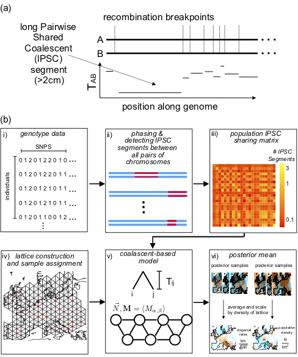

# Migration and Population Surface estimation (MAPS)



MAPS estimates time-resolved dispersal rates and population densities based on the number of shared long Pairwise Coalescent Segments (lPSC). 

## Compatability

*MAPS has been tested with Eigen 3.2.2 and Boost 1.57 on OSX and Linux and might not be compatible with newer versions of Boost/Eigen.*

Please post bugs, questions and feature requests or suspected bugs to
[Github issues](https://github.com/halasadi/MAPS/issues).

## Quick Start

Follow these steps to quickly get started using MAPS.

For installing the software dependencies, we provide detailed
instructions using the
[conda package manager](https://conda.io/docs). This is only a
recommended aproach---conda is not required to use MAPS, and other
approaches can be taken to install the dependencies (e.g., by directly
downloading the source code, or by using [Homebrew](http://brew.sh) for
Mac).

1. Install [GNU Make](https://www.gnu.org/software/make).

2. Install a [Conda](https://conda.io/docs) distribution such as
   [Anaconda](https://www.anaconda.com/download) or
   [Miniconda](https://conda.io/miniconda.html) (*optional*).

3. Create a new conda environment for MAPS (*optional*).

   ```bash
   conda create -n MAPS
   source activate MAPS
   ```

4. Install the [Boost](http://www.boost.org) C++ source libraries
   version 1.57.0. If using conda, run `conda install boost=1.57.0`.

5. Install the [Eigen](http://eigen.tuxfamily.org) C++ matrix algebra
   library. If using conda, run `conda install eigen`.

6. Clone or download this repository.

7. Adjust the Makefile variables as needed to suit your computing
   environment. See the instructions in the [Makefile](src/Makefile)
   for details. For example, if you installed the Boost and Eigen
   libraries with conda, then you would add the following flags to the
   `CXXFLAGS` and `LDFLAGS` settings, respectively (again, see the
   Makefile for full details):

   ```
   -I$(HOME)/anaconda/envs/MAPS/include
   -L$(HOME)/anaconda/envs/MAPS/lib
   ```

8. Run `make` in the [src](src) subdirectory to build the `runeems2`
   binary executable.

9. Make sure that the Boost library is in the library search
   path. Typically this will involve updating the `LD_LIBRARY_PATH`
   (Linux) or `DYLD_LIBRARY_PATH` (macOS) environment variable; e.g.,

   ```bash
   export LD_LIBRARY_PATH=$HOME/anaconda/envs/MAPS/lib
   ```

10. Try running MAPS on the 2-6 cM PSC segments provided in the
    examples/2_6 subdirectory.

    ```bash
    cd examples
    ../src/runeems2 --params params-test-2_6.ini
    ```

    It may take 10--30 minutes for the MCMC simulation to complete.

11. Next, try running MAPS on larger PSC segments (>6 cM) to
    investigate at more recent population structure.

    ```bash
    ../src/runeems2 --params params-test-6_Inf.ini
    ```

12. install the
    [plotmaps](https://github.com/halasadi/plotmaps) package in R, and
    run the following code in R. This will generate plots for
    the MAPS analyses. The plots are saved as PDFs.

    ```R
    library(plotmaps)
    plot_maps(add.pts = TRUE, add.graph = TRUE, add.countries = FALSE,
         longlat = TRUE, mcmcpath = "2_6/2_6-MAPS-test-sim", 
         outpath = "2_6", width = 10, height = 6)
    plot_maps(add.pts = TRUE, add.graph = TRUE, add.countries = FALSE,
         longlat = TRUE, mcmcpath = "6_Inf/6_Inf-MAPS-test-sim", 
         outpath = "6_Inf", width = 10, height = 6, plot.difference=TRUE)
    ```

Continue reading for more detailed documentation on MAPS.

## Preparing data for MAPS

MAPS requires for input

* IBD sharing matrix (ends in .sims) (see below)
* coordinate file (ends in .coord). see eems documentation
* outer file (ends in .outer). see eems documentation

An IBD sharing matrix is required for MAPs (instead of an
disssimilarity matrix as in eems). The IBD sharing matrix ${X}$ is
defined such that $X_{i,j}$ is the number of IBD segments shared in a
length bin R between haploid $i$ and haploid $j$, the length bin or
range R is described below. In the MAPs paper we use the software
refinedIBD to call and phase diploid data. The sharing matrix must end
with with the prefix .sims, e.g. `popressard_2_Inf.sims`.

The length bin R is defined by a lowerbound and an upperbound on the
**cM** scale, and can be specified in the `params` file withe the
parameter `lowerBound` and `upperBound`. If `upperBound` entry is
blank, it is assumed to be infinity.

For example,
```
datapath = popressard_2_Inf.sims
lowerBound = 2
```

We also allow the capability to visualize IBD segments in a length
region, for example betweem 2cM and 8cM.  ``` datapath =
popressard_2_8.sims lowerBound = 2 upperBound = 8 ``` 

## parameter configuration

The MAPs software is built from the eems software and the software
usage is very similar. **Here, we only highlight the differences
between the usage of MAPs and EEMS**. Please see
https://github.com/dipetkov/eems for the usage in EEMS.

In comparison to EEMS, there are a few additional arguments in the `params` file,

* `genomeSize` (optional defaults to 3000cM)

* `nIndiv` (required, number of haploid individuals)

* `lowerBound` (required, lower bound in cM)

* `upperBound` (optional defaults to infinity, upper bound in cM)

* `olderpath` (optional, path to a run with a older time period, MAPS
               will only estimate the difference between rates from
               the older time period)

## Citing this work

If you find the MAPS program, or any source code contained in this
repository, useful for your work, please cite:

> TBA

## License

Copyright (c) 2017-2018, Hussein Al-Asadi.

The software and example programs in this repository are made
available under the terms of the
[MIT license](https://opensource.org/licenses/mit-license.html).
See [LICENSE](LICENSE) for the full text of the license.

## Credits

This project was developed by
[Hussein Al-Asadi](https://github.com/halasadi) at the University of
Chicago.

Thanks to [Matthew Stephens](http://stephenslab.uchicago.edu) and
[John Novembre](http://jnpopgen.org) for their support and mentorship.
